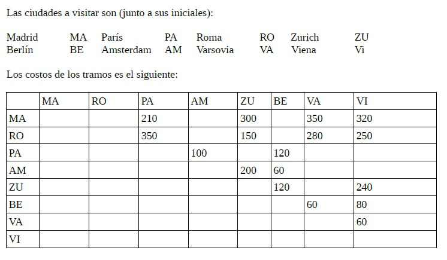
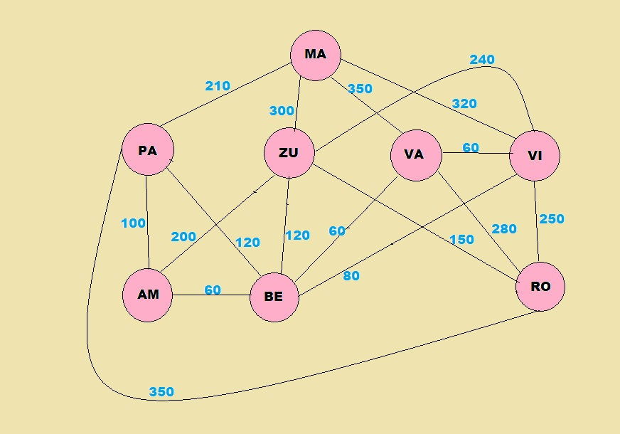

# TP3---AyE

## CONSIGNA: Problema de Optimizacion

Los alumnos que promocionan Algoritmos y Estructuras de Datos están planeando realizar un viaje a Europa para festejar la promoción. El plan es llegar a Madrid y hacer un recorrido por 8 ciudades en total, regresando a Madrid. Como el presupuesto es limitado, **no deben repetir ciudades** y además analizar varias opciones para tomar una decisión de como hacer el **recorrido más económico**. El
costo de los tramos entre ciudades es simétrico.

Representado en un grafo no dirigido:

La representación de los costos es simetrica ya que el grafo es no dirigido. Filas es origen y columnas destino. El problema se denomina tradicionalmente como “ciclo Hamiltoneano”. Puede ver un video explicatorio del algoritmo en [link](https://www.youtube.com/watch?v=-AX-U6Ok0is). Sin embargo, dadas las multiples conexiones entre las ciudades deseadas, puede haber más de un ciclo Hamiltoneano posible, por lo que deberá encontrar todos los ciclos posibles y determinar el de menor costo.

Para encontrar todos los ciclos, deberá aplicar un algoritmo de **búsqueda en amplitud** (bfs), utilizando un árbol m-ario que tenga como raiz un punto de partida y cada hijo represente la próxima ciudad que puede accederse y que sea una opción válida a los fines del ciclo. Tenga en cuenta las propiedades que deben cumplir los ciclos Hamiltoneanos expuestos en el link anterior ya que permite minimizar la cantidad de opciones a evaluar y por ende, el tiempo de procesamiento total del algoritmo.
Para todos los ciclos Hamiltoneanos determinados debe imprimir la secuencia de ciudades que lo conforman y el costo total del mismo.

1. Armar grafos:

   - matrices
   - arbol m-ario

2. Buscar Ciclos Hamiltoneanos (bfs):

   - Todos los vertices de grado >= 2
   - Si ya se incorporaron 2 aristas de un vertice el resto se descartan para ese ciclo
   - Cada vertice del ciclo puede tener dos aristas incidentes
   - El ciclo hamiltoneano debe contener todos los vertices del grafo

3. Calcular costos de cada ciclo y elegir el optimo

PENDIENTE:

1. Calcular costos, imprimirlos
2. Elegir el mas economico
3. Optimizar algoritmo en base a las propiedades de los ciclos hamiltonianos
4. Verificar lo del recorrido en amplitud
5. Grafo a partir de matriz (HECHO EN PRUEBAS)
